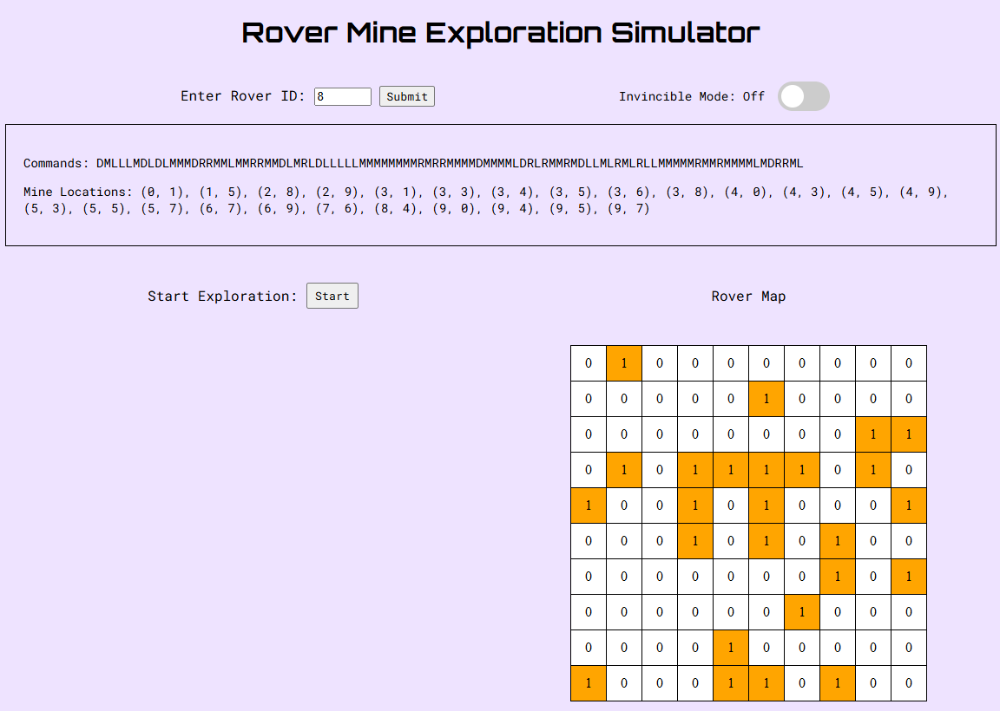

# Rover Mine Exploration Simulator

This project focuses on developing rovers (clients) capable of detecting and mapping mines and correctly handling either the disarming or explosions upon encountering a mine. The system is designed to explore different communication methods between the client and the server, specifically: gRPC, RabbitMQ and FastAPI. 

## Table of Contents 
- [gRPC](#gRPC)

## gRPC
- Enables communications between rovers and server using a Protocol Buffer Definition File (.proto) to define the service and messages used for communication. 

#### To run the program:
1. **Install Packages from `requirements.txt`**
  - `cd gRPC`
  - `pip install -r requirements.txt`

2. **Compile the Proto Buffer File**
  - `python generate_proto.py`

3. **Run the Server**
  - `python server.py`

4. **Run the Client**
  - `python client.py <rover_id>`

## RabbitMQ 
- Facilitates communication between rovers and the server by sending messages between producers and consumers for mine detection and disarming. 

#### To run the program:
1. **Install Chocolatey**
  - Open PowerShell and Run as Administrator 
  - `Set-ExecutionPolicy Bypass -Scope Process -Force;`
  - `Invoke-Expression ((New-Object System.Net.WebClient).DownloadString('https://community.chocolatey.org/install.ps1'))`
2. **Install RabbitMQ**
  - `choco install rabbitmq`
3. **Install Docker Desktop**
4. **Run RabbitMQ using Docker**
  - `docker run -d --name rabbitmq -p 15672:15672 rabbitmq:management`
5. **Install Packages from `requirements.txt`**
  - `cd RabbitMQ`
  - `pip install -r requirements.txt`
6. **Compile the Proto Buffer File**
  - `python generate_proto.py`
7. **Run the Server in One Terminal**
  - `python server.py`
8. **Run the Client in Another Terminal**
  - `python client.py (prompted to enter Rover ID)`
9. **Run the Deminer in a Third Terminal**
  - `python deminer.py (prompted to enter Deminer ID)`
10. **Open RabbitMQ Management Console at `localhost:15672`**
  - Login Credentials: username/password `guest` 

## FastAPI 
- Used to facilitate RESTful communication of an operator with a server. This framework allows for the creation of dynamic endpoints that handle requests for random map generation, rover command retrieval, mine detection and disarming. Additionally, an integrated user interface provides a real-time view of the rover simulation and interaction with the system. 

### Preview

#### To run this program: 
- Without Azure/Docker: 
  1. **Install Packages from `requirements.txt`**
    - `cd FastAPI`
    - `pip install -r requirements.txt`
  2. **Run the FastAPI Server**
    - `uvicorn main:app --reload (can also specify port by using: --port <port-number>)`
  3. **Access the API Documentation**
    - Navigate to `/docs`
- With Azure/Docker:
  1. **Build the Docker Image** 
    - `docker build -t <your-repository-name>.azurecr.io/myapp:latest .`
  2. **Push the Docker Image to Azure Container Registry**
    -  `docker push <your-repository-name>.azurecr.io/myapp:latest`
  3. **Access the Web App**
    - Use the default or provided Azure domain